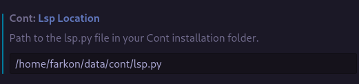

# Cont Language Support

Support for cont programming language for VS Code with syntax highlighting and language server features. 

## Quick Start
Compile the extension, create a symlink to this folder in `~/.vscode/extensions`. Restart VS Code afterwards.
```sh
cd vscode
npm install
npm run compile
ln -s $HOME/data/cont/vscode ~/.vscode/extensions/farkon00.cont-0.0.1
code
```
Now set "Cont: Lsp Location" in VS Code settings to the path to `lsp.py` file in your cont installation directory.
<br>
Enjoy!

## Features

* Syntax highlighting for `.cn` files
* Error reporting for cont source code.

## Requirements

Cont programming language installed.